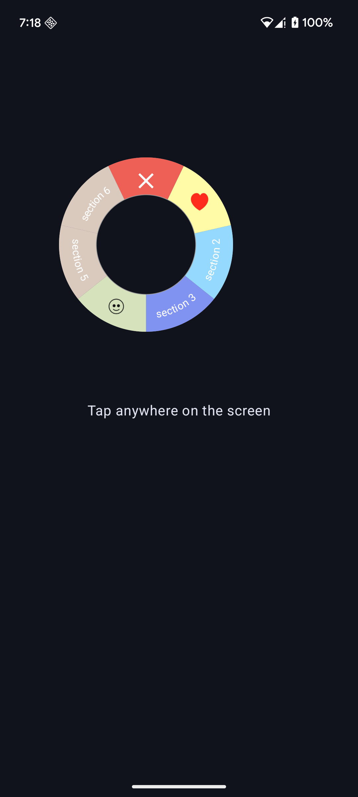

## FloatingToolbox Compose

A customizable Jetpack Compose **video-game-wheel-style popup menu** for Android.

Display a circular toolbox with sections that expand around a center button. Each section can show an icon or a curved label, everything is fully customisable!




---

## 📦 Add the dependency (via JitPack)

### 1. In your root `settings.gradle` or `settings.gradle.kts`

Groovy

```groovy
dependencyResolutionManagement {
    repositories {
        google()
        mavenCentral()
        maven { url 'https://jitpack.io' }
    }
}
````

Kotlin DSL

```kotlin
dependencyResolutionManagement {
    repositories {
        google()
        mavenCentral()
        maven(url = "https://jitpack.io")
    }
}
```

### 2. In your module `build.gradle`

```groovy
dependencies {
    implementation 'com.github.tabinGlitchHub:FloatingToolboxCompose:1.0.1'
}
```

You can check out the latest stable version from the releases section.


---

## 🚀 Usage Example

You can always run the application hosted by the repo, but here is a quick example:

```kotlin
@Composable
fun MyScreen() {
    val showPopup = remember { mutableStateOf(false) }
    val buttonPos = remember { mutableStateOf(Offset.Zero) }

    Column(
        modifier = Modifier
        .padding(innerPadding)
        .pointerInput(Unit) {
        /* the position is fetched from where the user's touch within the container's bounds*/
        detectTapGestures { offsetInBox ->
                popPosition.value = offsetInBox
                showPopup.value = true
            }
        }
        .fillMaxSize()
    ) {
        FloatingToolbox(
            buttonPosition = popPosition,//feed the position here, this will be the origin to render the composable
            onCenterClick = { println("center clicked") },
            showPopup = showPopup,
            onSectionClick = { println(it) },
            donutSize = 200.dp,
            centerButtonIcon = null,
            animationEnabled = true,
            slicePopDelay = 30,
        )
    }
}
```

---

## ⚙️ Options

| Parameter                  | Type                     | Default                                                     | Description                                                               |
| -------------------------- | ------------------------ | ----------------------------------------------------------- | ------------------------------------------------------------------------- |
| `buttonPosition`           | `MutableState<Offset>`   | *required*                                                  | Coordinates where the popup will be anchored (usually tap location).      |
| `showPopup`                | `MutableState<Boolean>`  | *required*                                                  | Controls the visibility of the popup. Set `false` to dismiss.             |
| `donutSize`                | `Dp`                     | `160.dp`                                                    | Total diameter of the circular menu.                                      |
| `thickness`                | `Dp`                     | `85.dp`                                                     | Width of the donut ring.                                                  |
| `animationEnabled`         | `Boolean`                | `true`                                                      | Whether sections animate as they appear.                                    |
| `closeSectionColor`        | `Color`                  | `Color(0xFFee6055)`                                         | Background color of the close (0th) section.                              |
| `closeSectionIcon`         | `ImageVector`            | `Icons.Outlined.Close`                                      | Icon shown in the close section.                                          |
| `closeSectionTint`         | `Color`                  | `Color.White`                                               | Tint color applied to `closeSectionIcon`.                                 |
| `centerButtonIcon`         | `ImageVector?`           | `Icons.Outlined.Edit`                                       | Icon rendered in the center of the donut (hides if `null`).                 |
| `sectionIconSize`          | `Dp`                     | `20.dp`                                                     | Size of icons in the donut ring.                                          |
| `sectionLabelAndColorList` | `List<Pair<Any, Color>>` | Custom list + mandatory close slice                         | Content for each section. `Any` can be a `String` or icon resource `Int`. |
| `onSectionClick`           | `(Int) -> Unit`          | *required*                                                  | Callback for when a section is tapped.                                    |
| `onCenterClick`            | `() -> Unit`             | *required*                                                  | Callback for when the center button is tapped.                            |
| `animationSpec`            | `AnimationSpec<Float>`   | `spring(Spring.DampingRatioLowBouncy, Spring.StiffnessLow)` | Specifies animation used when slices scale into view.                     |
| `slicePopDelay`            | `Long`                   | `60L`                                                       | Delay in ms between each slice’s animation (for staggered effect).        |


---

## 📄 License

```
MIT License

Copyright (c) [year] [fullname]

Permission is hereby granted, free of charge, to any person obtaining a copy
of this software and associated documentation files (the "Software"), to deal
in the Software without restriction, including without limitation the rights
to use, copy, modify, merge, publish, distribute, sublicense, and/or sell
copies of the Software, and to permit persons to whom the Software is
furnished to do so, subject to the following conditions:

The above copyright notice and this permission notice shall be included in all
copies or substantial portions of the Software.

THE SOFTWARE IS PROVIDED "AS IS", WITHOUT WARRANTY OF ANY KIND, EXPRESS OR
IMPLIED, INCLUDING BUT NOT LIMITED TO THE WARRANTIES OF MERCHANTABILITY,
FITNESS FOR A PARTICULAR PURPOSE AND NONINFRINGEMENT. IN NO EVENT SHALL THE
AUTHORS OR COPYRIGHT HOLDERS BE LIABLE FOR ANY CLAIM, DAMAGES OR OTHER
LIABILITY, WHETHER IN AN ACTION OF CONTRACT, TORT OR OTHERWISE, ARISING FROM,
OUT OF OR IN CONNECTION WITH THE SOFTWARE OR THE USE OR OTHER DEALINGS IN THE
SOFTWARE.
```

---

Feel free to contribute or report issues!
If you use this in a project, drop a ⭐️ on the repo!

